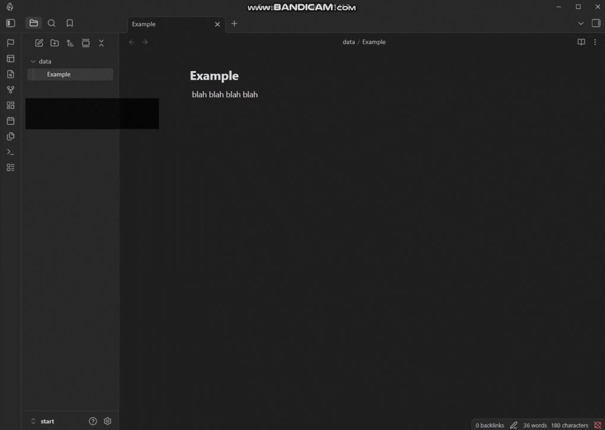

# Quick Notes Popup

Plugin that lets you open a command-triggered popup to quickly capture notes without interrupting your writing flow.

Inspired by this reddit post: https://www.reddit.com/r/ObsidianMD/comments/186n32z/plugin_request/ 




---

## Features

- Open a popup via command palette  
- Instantly type and save notes from any page  
- 100% Keyboard-first navigation (Arrow keys + Enter)  
- One-click copy to clipboard  
- Export notes to Markdown  
- Persistent storage using Obsidian's built-in data API  

---

## Why This Plugin?

When writing in Obsidian, switching context to create a separate note can break focus.

Quick Notes Popup allows you to:

- Capture ideas instantly  
- Copy snippets on demand  
- Store temporary or reusable notes  
- Maintain uninterrupted writing flow  

This plugin was created based on requests from users in the Obsidian community.

---

## Manual Installation

1. Download the latest release
2. Extract into your vault:
   ```
   <vault>/.obsidian/plugins/quick-notes-popup/
   ```
3. Reload Obsidian
4. Enable the plugin in Community Plugins settings

---

## Usage

1. Set the plugin's Hotkey
2. Run the Hotkey
3. Type your note
4. Press **Enter** to save
5. Click 'Delete' to delete note
6. Click 'Export...' to export note

---

## Settings

- **Persistent on Insert**  
  Keep popup open after inserting a note.

- **Persistent on Delete**  
  Keep popup open after deleting a note.

---

## Export Format

Notes are exported in Markdown format:

```md
>
> Your note content  
>
  _YYYY-MM-DD HH:mm_
```

---
