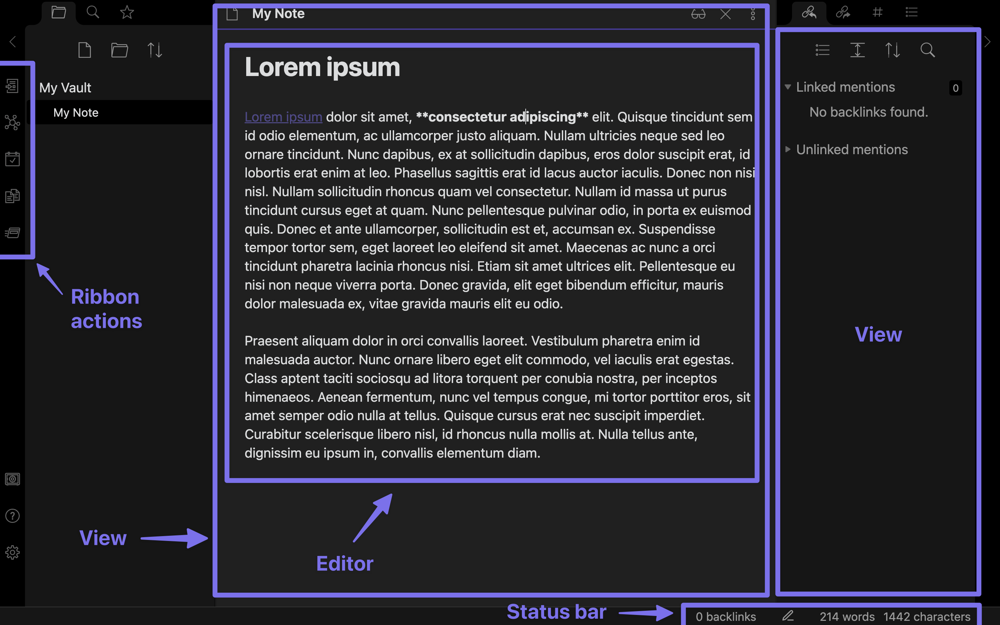
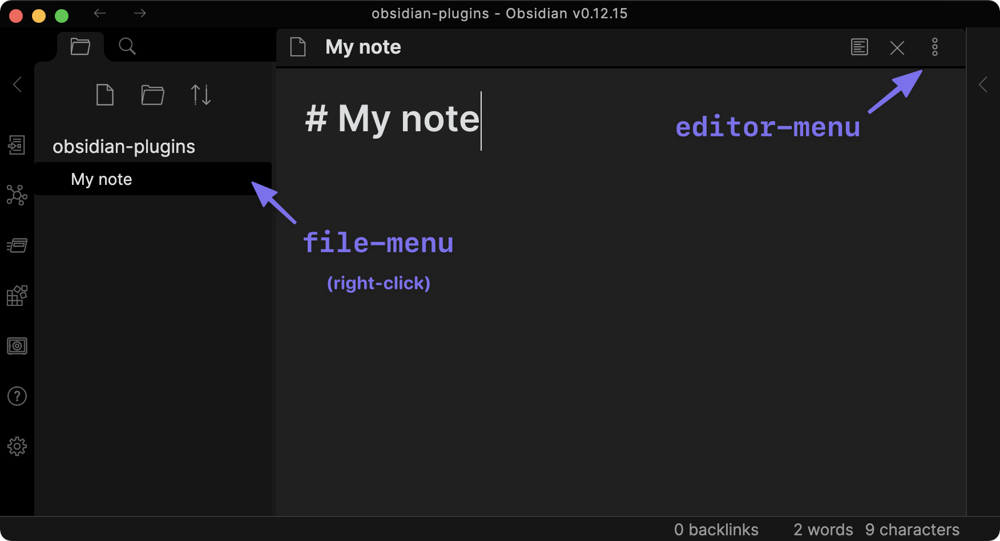

# Views
All views are created as instance of `DeferredView`. When a view is visible on screen (ie the tabl is selected within its containing tab group), the leaf will rerender and the view will be switched out to the correct `View` instance.

